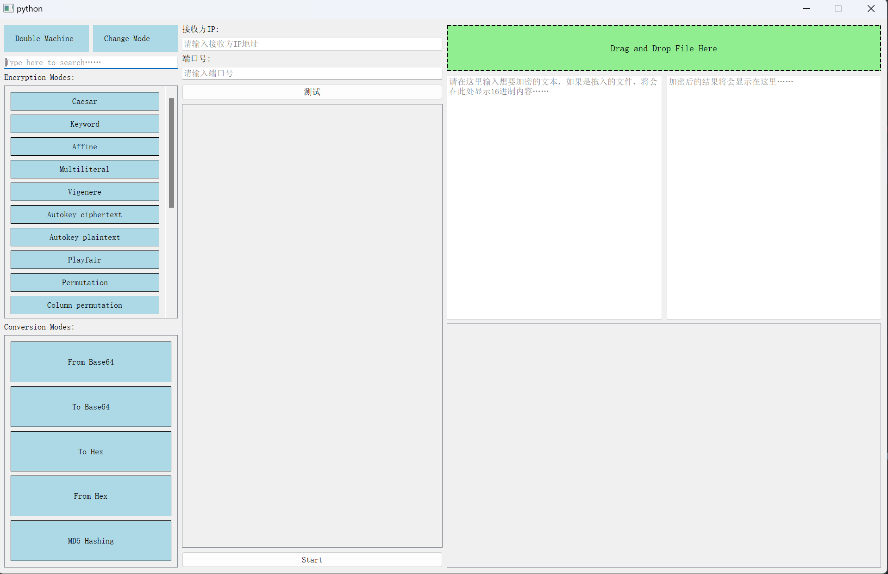
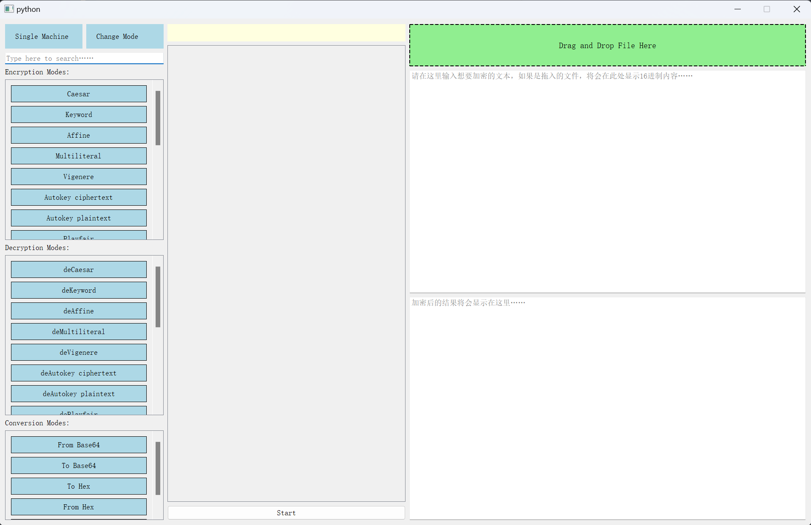

# CipherCraft

该项目目前还在开发中 ...

## 简介
CipherCraft 是一个用于加密和解密文本/文件的工具。它提供了多种加密算法供用户选择，并且易于扩展和使用。

该工具包括了单机和双机模式

- 单机模式：单机模式下，用户可以在本地完成加密和解密操作。
- 双机模式：双机模式下，用户可以在两个不同的设备之间进行加密通信（加密算法可以自定义）。

## 安装

### 前提条件
- Python 3.6 或更高版本

### 下载依赖包
进入项目根目录后，运行以下命令安装所需的依赖包：
```bash
pip install -r requirements.txt
```

## 使用方法
该项目提供了完善的图像化界面，用户可以提供运行以下命令启动：
```bash
python main.py
```
界面如下：
1. 单机模式

2. 双机模式

