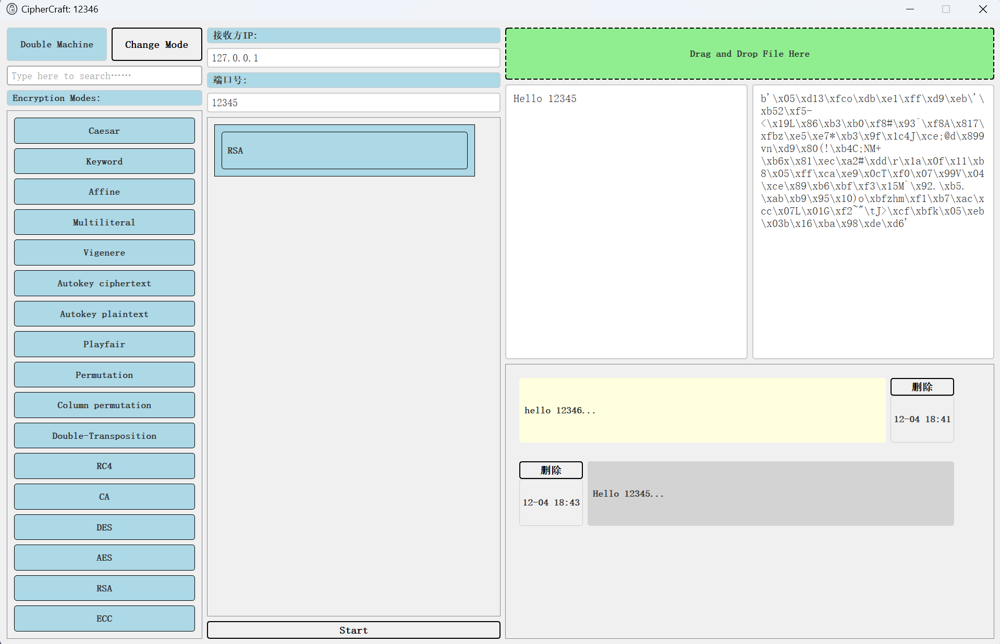

# CipherCraft

## 简介
CipherCraft 是一个用于加密和解密文本/文件的工具。它提供了多种加密算法供用户选择，并提供了双机模式，用于在两个设备之间进行加密通信。

该工具包括了单机和双机模式

- 单机模式：
    - 单机模式下，用户可以在本地完成自定义的加密和解密操作。
    - 单机模式下，用户也可以将文件拖入界面，得到文件的16进制表示，继续接下来的加密/解密操作。
- 双机模式：
    - 双机模式下，用户可以在两个不同的设备之间进行加密通信（加密算法可以自定义）。
    - 双机模式下，用户也可以将文件拖入界面，进行传输，接收方接受到文件可以点击详情，并见结果重新转为本地文件。

## 安装

### 前提条件
- Python 3.6 或更高版本

### 下载依赖包
进入项目根目录后，运行以下命令安装所需的依赖包：

```bash
pip install -r requirements.txt
```

## 使用方法
该项目提供了完善的图像化界面，用户可以提供运行以下命令启动：

```bash
python main.py
```

界面如下：

1. 单机模式


2. 双机模式




## 项目打包
项目打包使用PyInstaller，打包命令如下：

```bash
Pyinstaller -F -w -i ./frontend/src/cc.ico --add-data "frontend/src;frontend/src" main.py
```

打包完成后，会在当前目录下生成一个名为`dist`的文件夹，里面包含打包后的exe文件，你可以直接运行该exe文件启动他。
